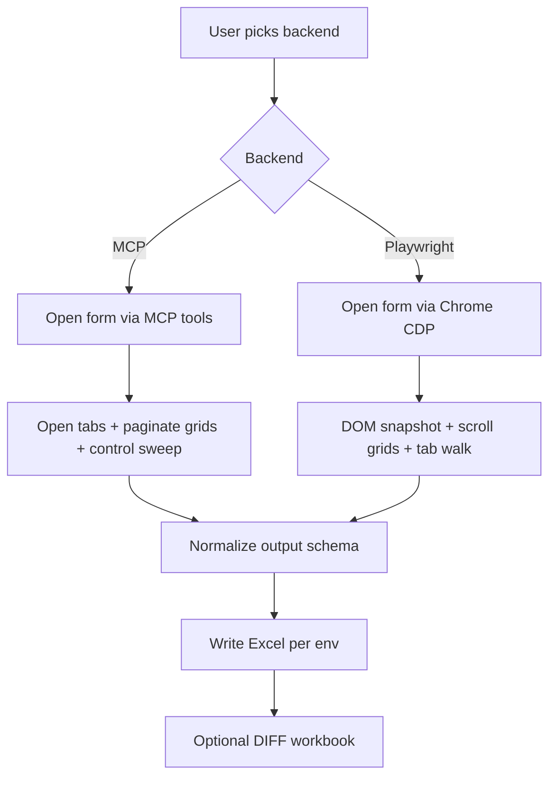

# D365 Extraction Diagrams

## 1) MCP Pipeline (6-box)

```mermaid
flowchart LR
    A[Start Extraction] --> B[Open Form via MCP]
    B --> C[Open All Tabs and FastTabs]
    C --> D[Paginate All Grids]
    D --> E[Sweep Hidden Controls]
    E --> F[Normalize Data]
    F --> G[Write Excel and Diff]
```

## 2) MCP vs Playwright

```mermaid
flowchart TD
    U[User picks backend] --> B{Backend}
    B -->|MCP| M1[Open form via MCP tools]
    B -->|Playwright| P1[Open form via Chrome CDP]

    M1 --> M2[Open tabs + paginate grids + control sweep]
    P1 --> P2[DOM snapshot + scroll grids + tab walk]

    M2 --> O[Normalize output schema]
    P2 --> O
    O --> X[Write Excel per env]
    X --> D[Optional DIFF workbook]
```
